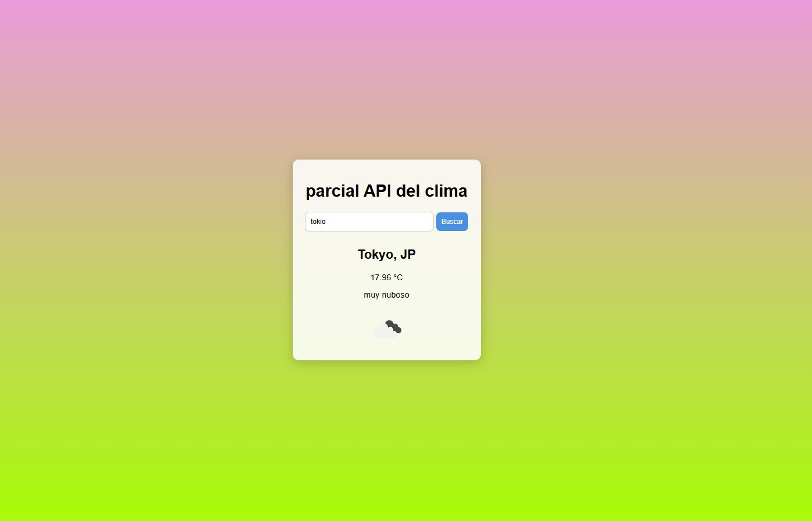

# Parcial API del Clima

Aplicación web desarrollada como **parcial académico** que consume una API del clima y muestra en tiempo real las condiciones meteorológicas de cualquier ciudad del mundo. El usuario ingresa el nombre de una ciudad y la app responde con la temperatura actual, una breve descripción del estado del cielo y un ícono representativo.

## Vista previa



## Objetivo del parcial

Demostrar el manejo de los siguientes conceptos vistos en clase:

- Consumo de APIs REST mediante `fetch`.
- Manejo de promesas y operaciones asíncronas con `async/await`.
- Manipulación del DOM con JavaScript nativo.
- Manejo de eventos en formularios.
- Estructuración de una página con HTML semántico.
- Estilos y diseño con CSS.

## Tecnologías utilizadas

- **HTML5** — estructura del documento.
- **CSS3** — estilos y diseño de la interfaz.
- **JavaScript (ES6+) nativo** — lógica de la aplicación, manipulación del DOM y consumo de la API. No se utilizó ningún framework ni librería externa.
- **OpenWeatherMap API** — fuente de los datos meteorológicos.

## Estructura del proyecto

```
parcial-api-clima/
├── index.html
├── styles.css
├── script.js
└── README.md
```

## Cómo ejecutar el proyecto

1. Clonar el repositorio:
   ```bash
   git clone https://github.com/usuario/parcial-api-clima.git
   cd parcial-api-clima
   ```

2. Abrir el archivo `index.html` directamente en el navegador, o bien levantar un servidor local sencillo. Por ejemplo, con Python:
   ```bash
   python -m http.server 8000
   ```
   Y luego abrir [http://localhost:8000](http://localhost:8000) en el navegador.

3. Antes de probar la app, agregar la API key de OpenWeatherMap dentro de `script.js`, en la constante correspondiente.

## Obtener una API Key

1. Crear una cuenta gratuita en [OpenWeatherMap](https://openweathermap.org/api).
2. Ir a la sección **API keys** y copiar la clave generada.
3. Pegarla en el archivo `script.js` en la variable destinada para ello.

## Funcionalidades

- Búsqueda de ciudades por nombre desde un campo de texto.
- Visualización de la temperatura en grados Celsius.
- Descripción textual del estado del clima en español.
- Ícono dinámico según las condiciones meteorológicas.
- Manejo básico de errores cuando la ciudad no se encuentra.

## Aprendizajes

Durante el desarrollo de este parcial se reforzaron los siguientes conocimientos:

- Cómo realizar peticiones HTTP a una API externa con `fetch`.
- Cómo trabajar con respuestas asíncronas en JavaScript.
- Cómo seleccionar y modificar elementos del DOM de forma dinámica.
- Cómo estructurar una pequeña aplicación web sin recurrir a frameworks.

## Autor

**Miguel Ángel Escobar**
Institución Universitaria de Envigado
Año 2025

## Licencia

Este proyecto fue desarrollado con fines académicos.
